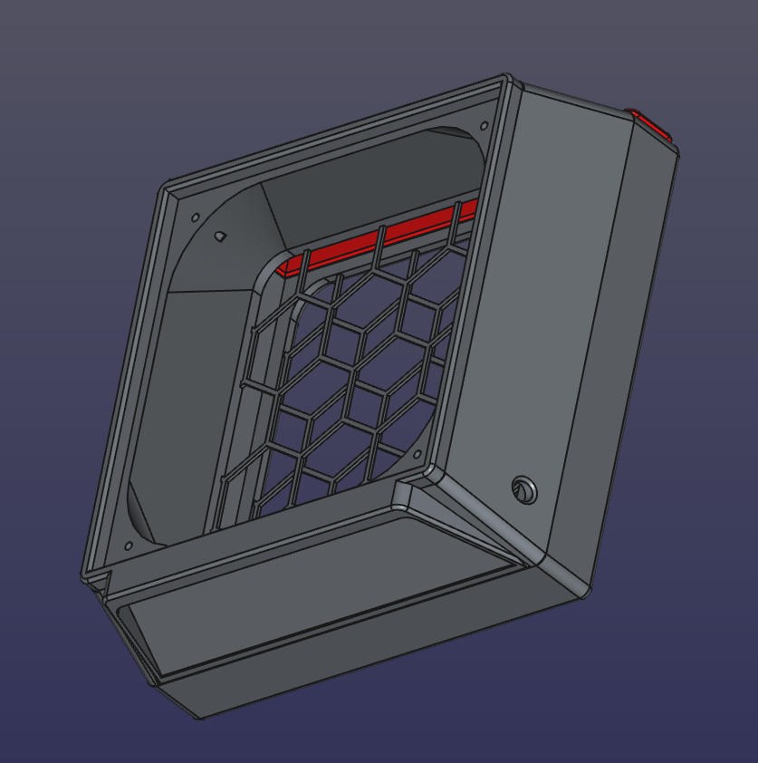
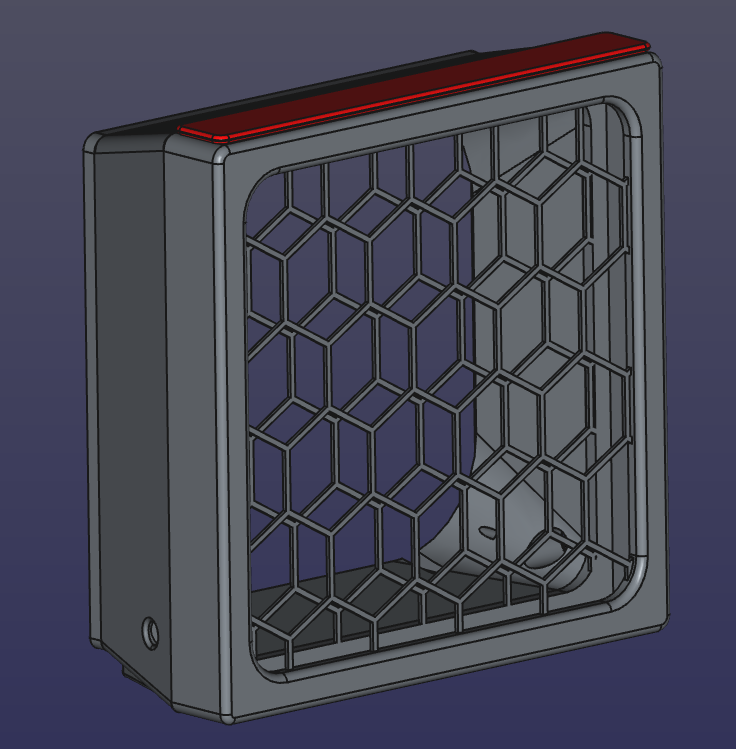
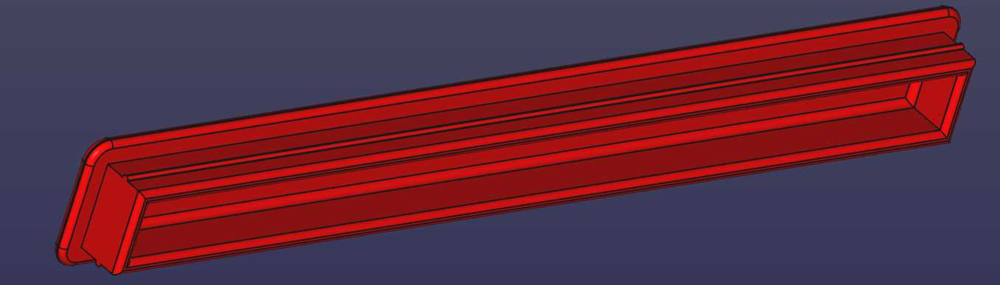
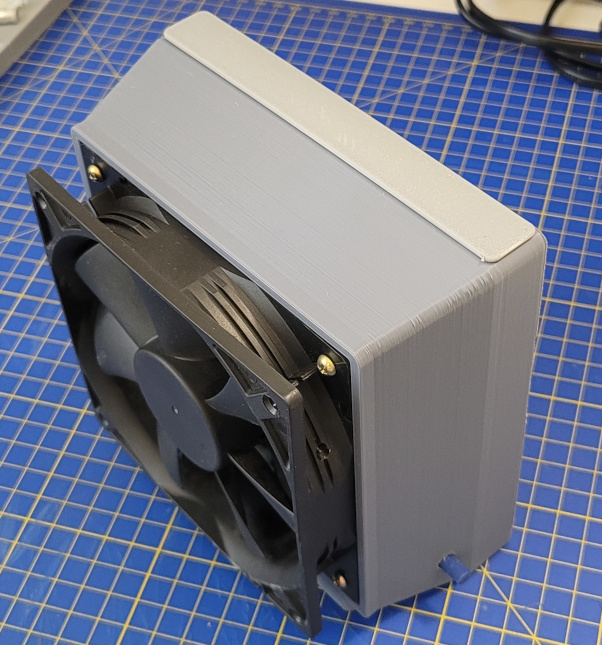
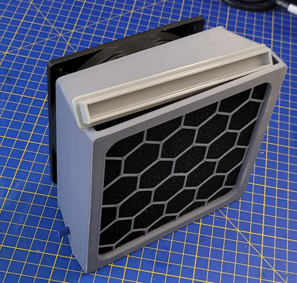

Fume extractor for soldering
============================

The structure is designed to fit a 13x13 filter and a 12x12 PC fan. It has been printed in PLA except for the TPU cap.

I printed it in low quality. The worst thing is the grid which suffered from being printed on supports and it is probably too thin.. But indded this thing is doing his job :)

