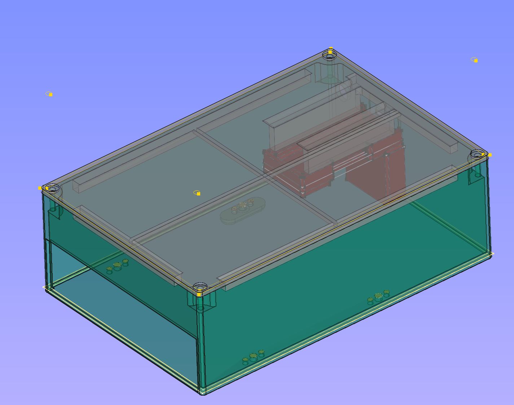
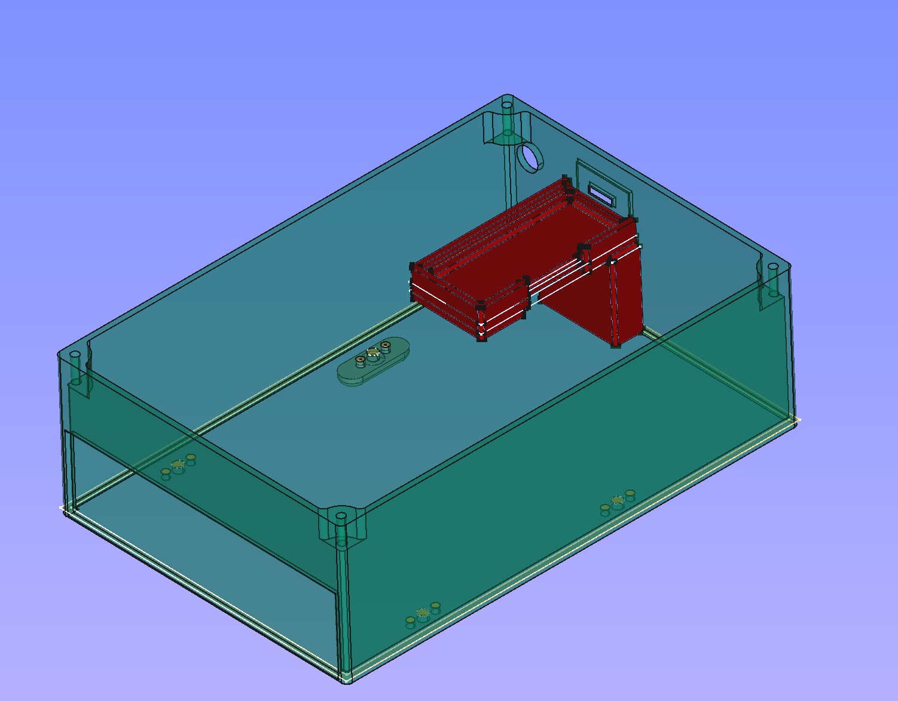
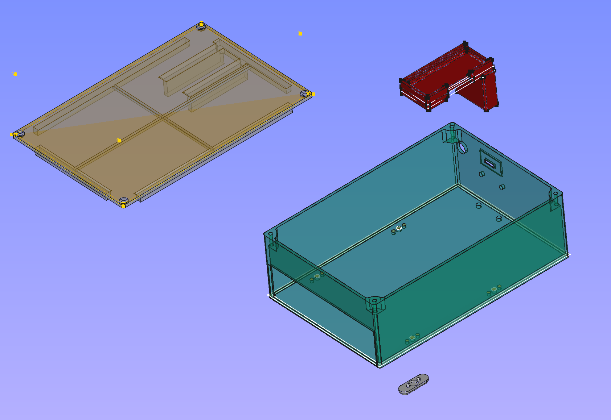

This is a [greaseweazle](https://github.com/keirf/greaseweazle) 3.5" floppy drive enclosure.

WARNING: there are probably better designs on the web. This is just mine, and it fits with my floppy drive; other have connectors placed elsewhere and wouldn't fit in this box.

[here](./photos) some photos of the printed object
