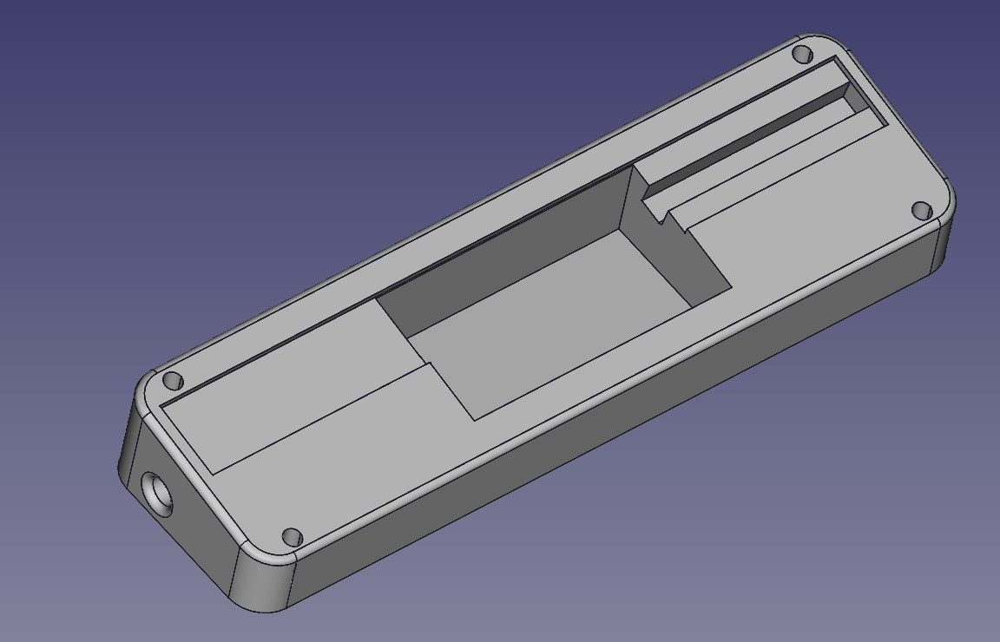

# Holder for piece of RGB strip to enlight starship model

The part holds the RGB strip and a small DC/DC converter to enable the strip to be USB powered.
I've statically choosen the color by just powering the G+B leds, letting the R channel unpowered.

