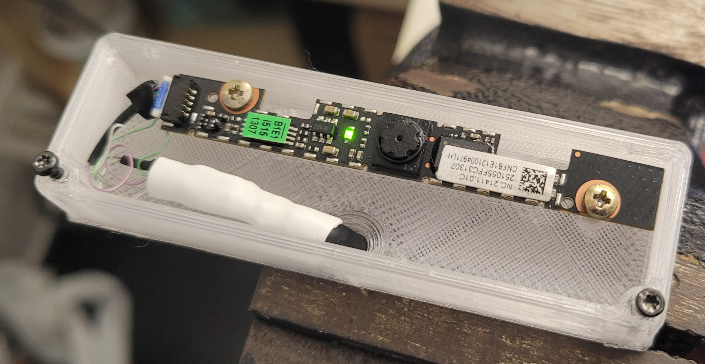

laptop webacm box
-----------------

Simple box for an integrtated webcam recovered from an old laptop.

Webcam integrated in laptop are usually USB and can be connected to an USB port with some adaption (basically 3v3 regulator). In this case I connected it to a RPi, so I had a 3v3 power source available :)

NOTE: The screws holes turned out to be not perfectly positioned, but it worked.
NOTE: The cap clips almost failed to print with these settings (but they still did "click", so I didn't re-print it.
NOTE: The lens hole is a bit off-axis, but still good enough

I used the webcam to keep an eye on my 3d printer :)

